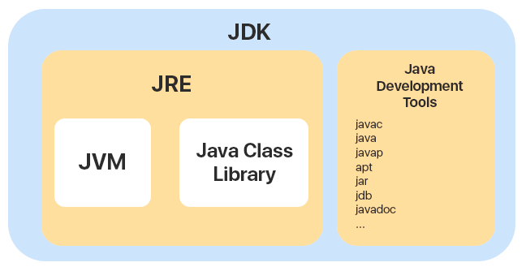
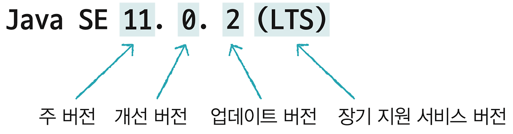

# JVM JRE JDK 차이
자바는 컴파일러를 통해 기계어로 변환되는 언어입니다.

## JVM(Java Virtual Machine)과 JRE(Java Runtime Environment)
JVM은 자바 가상머신의 약자로서, 자바를 돌리는 프로그램입니다.
Java로 작성된 모든 프로그램은 JVM에서만 실행될 수 있으므로, 어떤 OS던 JVM이 설치되어 있다면, Java프로그램을 실행할 수 있습니다.

JVM은 자바 실행환경인 JRE(Java Runtime Environment)가 포함되어 있습니다. 그래서 현재 사용하는 pc OS에 맞는 JRE가 설치되어 있다면, 올바른 JVM이 설치되어 있다는 뜻이기도 합니다.

C언어는 소스코드를 Binary Code(기계어)로 바로 변환하여 하드웨어에 의해 읽어지기 때문에 OS 환경에 따라 코드가 달라져야 했던 것과 달리, JAVA는 아래 과정을 거치며 코드 수정이 불필요하게 되었습니다.

1. Java Compiler가 Java로 작성된 소스코드 .java 파일을 .class 파일인 Byte Code로 컴파일한다. (이 코드는 JVM이 이해할 수 있는 코드이다.)

2. 변환한 Byte Code를 기계어로 변환시키기 위해 가상 CPU가 필요한데, 이것이 JVM의 역할이다. JVM이 Byte Code를 Binary Code로 변환한다.

3. 이렇게 JVM에 의해 컴파일된 기계어는 바로 CPU에서 실행되어 사용자에게 서비스를 제공한다.

## JDK (Java Development Kit)
JDK는 자바 개발키드의 약자로 개발자들이 자바로 개발하는데 사용되는 SDK(Software Develpment Kit, 소프트웨어 개발키트)이다.

JDK 안에는 Java 개발 시 필요한 라이브러리와, javac, javadoc 등의 개발 도구들을 포함하며, 앞서 말한 JRE도 함께 포함되어 있다.

아래 그림과 같이 JDK는 JVM, JRE를 모두 포함하며, 이외에도 Java 개발에 필요한 Development Tools를 포함한다.

### JDK 버전 표기
Java의 버전을 표기할 때 보통 JDK 또는 Java SE 버전으로 나타낸다.

초기 버전인 1.0/1.1 버전에서는 JDK 1.0 / JDK 1.2 이런 식으로 표기했지만, JDK 1.2를 발표하며 J2SE(Java2 Standard Edition)로 변경하게 된다. 
이후 JDK 1.6부터 Java SE(Java Standard Edition)로 변경되었다.

    - Java SE(Java Standard Edition) : 가장 표준 에디션의 플랫폼으로 자바 언어의 핵심 기능을 제공한다.

    - Java EE(Java Enterprise Edition) : 대규모 기업용 에디션으로 대형 네트워크 개발 시 사용한다.

    - Java ME(Java Micro Edition) : 작은 임베디드 기기들 같은 작은 기기를 다루는데 이용한다.

    - Java FX : 가볍고 예쁜 그래픽 사용자 인터페이스를 제공하는 에디션이다.

### Java 상세 버전 표기법

- 주 버전 : Java 언어에 많은 변화가 있을 경우

- 개선 버전 : 주 버전에 일부 사항 개선

- 업데이트 버전 : 버그가 수정될 때 마다 증가.

- LTS(Long Term Support) : 장기 지원 서비스를 받을 수 있는 버전

### JDK 종류
Java는 워낙 인기있는 프로그래밍 언어이기 때문에 JDK 종류가 여러가지이다.

    - Oracle JDK : Oracle에서 제공하는 JDK, 구독을 통해 유료 라이센스를 구매할 수 있다.
    - Open JDK : 무료 JDK이다.
    - Azul Zulu : Mac등에서 사용할 수 있는 바이너리를 제공한다.
    - Amazone Corretto : AWS 에서 제공하는 JDK로, AWS에서 쉽게 사용 가능하다.
    - Temurin(AdoptOpen JDK) : Eclipse에서 제공하는 JDK이다.
